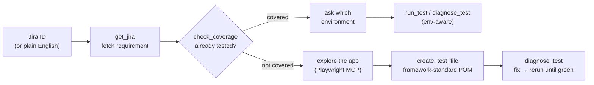
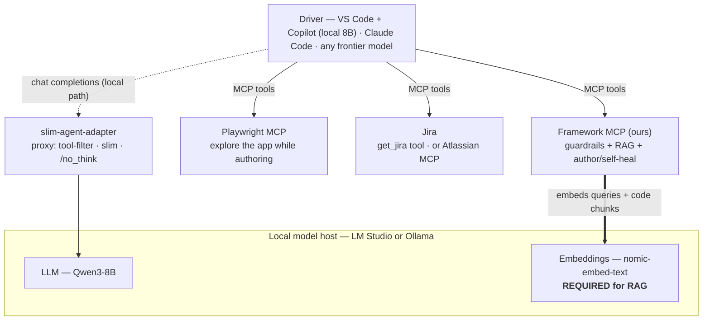
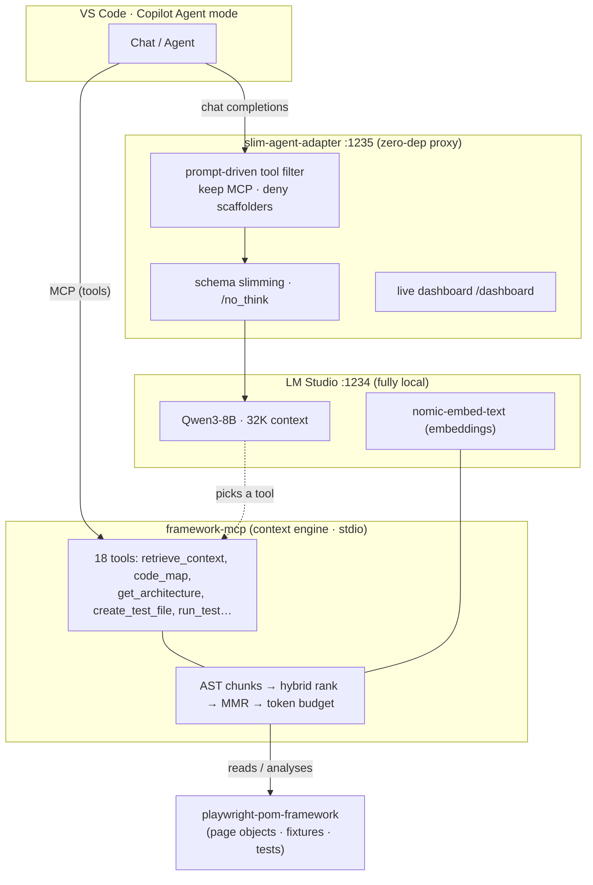

# PlayWright · RAG · Custom MCP · Adapter

**A full-stack, plug-in QA utility that takes a Jira ticket to a passing test — fully local.**

> Give it a **Jira ID**. It fetches the ticket, checks whether existing tests already cover it, and then either **runs them against the environment you choose** or **authors a brand-new, framework-standard Playwright test and self-heals it until it passes** — driven by a local model on a 24 GB laptop (or Claude Code, or any frontier model). **No cloud, no API keys, nothing leaves your machine.**

Under the hood, three pieces work together:
- a **custom MCP context engine** (RAG over *your* framework) that keeps every generated test in *your* page-object conventions;
- the official **Playwright MCP** to explore the real app while authoring (real selectors, not hallucinations);
- a **zero-dependency token-slimming adapter** that filters the per-turn tool payload so agent mode is fast enough on modest hardware.

It's **driver-agnostic** — the same tools work whether the brain is a local LLM (LM Studio + the adapter), **Claude Code**, or any frontier model. Clone it, run one setup wizard, and plug it into your Playwright + TypeScript repo.

> **Scope: web (browser) UI test automation** — Playwright + TypeScript. The explore-and-author flow drives a real browser, so **API-only, mobile, and visual testing are out of scope**. (The read-only analysis tools — coverage, conventions, code map — work on any Playwright TS repo, but the authoring path is web-UI.)

## The end-to-end journey



1. **Requirement in** — a Jira ID (`get_jira`) or plain English.
2. **Coverage check** (`check_coverage`) — related tests + a confidence verdict for you to confirm.
3. **Already covered?** it **asks which environment** to target, then runs the cases (env-aware).
4. **Not covered?** it explores the app with the Playwright MCP, authors a POM-correct spec in *your* conventions, then **self-heals** — `diagnose_test` → fix → rerun **until the test passes**.

You drive it in **plain English** — no need to name the tools; the assistant follows the workflow. Runs on Qwen3-8B @ 32K on a 24 GB machine (**validated on 166 real Playwright repos, 0 crashes**), and just as well on Claude Code or any frontier model.

---

## What's in the box

| Component | What it is |
|---|---|
| 🧠 **`framework-mcp`** | A **Custom MCP server + context engine**. Gives the model deep, structured knowledge of *your* Playwright framework (page objects, fixtures, conventions), generates tests in *your* pattern, draws architecture diagrams from real static analysis (ts-morph), and — the headline — a **RAG context engine** that returns a tight, token-budgeted slice of the codebase per question. |
| ⚡ **`slim-agent-adapter`** | A **zero-dependency, model-agnostic** OpenAI-compatible proxy. Filters the tool payload down to what the current prompt needs, slims tool schemas, disables Qwen3 "thinking", and ships a **live dashboard**. This is what makes agent mode usable on modest hardware. |
| 🎭 **`playwright-pom-framework`** | A **sample Playwright + TypeScript Page Object Model** framework (SauceDemo) — the system-under-test the MCP understands. 7 spec files, 18 tests, smoke → complex. |
| 🌐 **Playwright MCP** *(optional)* | The official [`@playwright/mcp`](https://github.com/microsoft/playwright-mcp) for live browser automation. **Off by default** to keep the tool load light; enable it only when you need a real browser. |

---

## The MCP stack (how the pieces compose)

The bundle orchestrates several MCPs + a proxy layer into one workflow:



| Piece | Type | Role in the journey |
|---|---|---|
| **Jira** | built-in **`get_jira`** tool **or** the **Atlassian MCP** | pull the ticket → the requirement |
| **Framework MCP** *(ours)* | one MCP server, two hats | **guardrails & rules** — POM conventions, page objects, `get_test_conventions` — **and RAG retrieval** — `retrieve_context`, `check_coverage`, `semantic_search` — plus authoring & self-heal (`create_test_file`, `diagnose_test`) |
| **Playwright MCP** | official `@playwright/mcp` | explore the real app while authoring (real selectors, not guesses) |
| **slim-agent-adapter** | a proxy, **not** an MCP | tool-filtering + schema-slimming + `/no_think` so it runs on a small local model; live dashboard |
| **Model host** | LM Studio **or** Ollama | serves the local LLM **and** the embedding model (`nomic-embed-text`) the RAG engine runs on |

> Two honest clarifications: (1) the **"custom MCP" and the "RAG" are the same server** — `framework-mcp` wears both hats, not two separate MCPs; (2) Jira is **either** our driver-agnostic `get_jira` tool **or** an external Atlassian MCP — you don't need both. The **adapter is a proxy layer**, not an MCP.

## Architecture



**The flow:** VS Code sends each turn to the **adapter**, which trims the tool payload and forwards to **Qwen3-8B** in LM Studio. When the model calls a tool, VS Code routes it to **framework-mcp**, whose **context engine** (built on local embeddings) returns just the relevant, budgeted slice of the framework — so 32K of context goes a long way.

---

## Why it's special

- **It runs on a potato.** M-series / 24 GB unified memory / Qwen3-8B / 32K — and it's *stable* (the 14B repeatedly crashed the machine; the 8B + these two layers does not).
- **It solves the real killer** — not model quality, but the **token/tool overload** every local setup hits and no one packages a fix for.
- **Framework-aware, not generic** — writes tests in *your* POM conventions; diagrams come from *real* static analysis, not hallucination.
- **Model-agnostic + reusable** — the adapter works with any OpenAI-compatible local model; the context-engine pattern works on any codebase.
- **Observable** — the dashboard shows exactly what's optimized per request, which local setups never expose.

Honest scope: this is **not** a frontier coding agent. It's a capable, private, framework-aware assistant that actually works on hardware you already own.

---

## Requirements

- **Node.js 18+**
- A local model host — **[LM Studio](https://lmstudio.ai)** (`:1234`) **or [Ollama](https://ollama.com)** (`:11434`). The setup wizard asks which.
- Models:
  - chat/agent — `qwen/qwen3-8b` (LM Studio) or `qwen3` (Ollama)
  - embeddings — `text-embedding-nomic-embed-text-v1.5` (LM Studio) or `nomic-embed-text` (Ollama) — **REQUIRED: RAG retrieval (`retrieve_context`, `check_coverage`, `semantic_search`) does not work without it.** The setup wizard loads/pulls it automatically.
- A **driver**: VS Code + GitHub Copilot Chat (custom OpenAI-compatible endpoint → the adapter or the host directly), **or** Claude Code, **or** any frontier model.
- ~24 GB RAM recommended for the local path (works within it — see [Troubleshooting](#troubleshooting)).

---

## Setup

```bash
git clone https://github.com/pruthive580/PlayWright-RAG-CustomMCP.git
cd PlayWright-RAG-CustomMCP
```

### Quick start (recommended) — interactive installer

```bash
node setup.mjs
```

It checks prerequisites, asks for your **framework path** and **machine tier**, builds the MCP, loads the local models via LM Studio, and writes your VS Code MCP config + Copilot model config + adapter launch command. **Pick tier 2 (high-spec) to skip the adapter entirely** — if you can comfortably run a 14B, you don't need it.

<details>
<summary><b>Manual setup</b> (if you'd rather do it by hand)</summary>

**1. Build the MCP (context engine)**
```bash
cd framework-mcp
npm install
npm run build          # produces dist/index.js
cd ..
```

**2. Install the sample framework (only if you want to run its tests)**
```bash
cd playwright-pom-framework
npm install
npx playwright install chromium
cd ..
```

**3. Load the models in LM Studio**
- Start LM Studio → *Developer* tab → **Start Server** (`:1234`)
- Load `qwen/qwen3-8b` with a **32K** context, single slot:
  ```bash
  lms load qwen/qwen3-8b -c 32768 --parallel 1 --gpu max
  lms load text-embedding-nomic-embed-text-v1.5
  ```
  > Tip: LM Studio's `--parallel` defaults to 4, which **quadruples** the KV cache — always pass `--parallel 1` for single-user.

**4. Start the adapter** (recommended flags shown)
```bash
cd slim-agent-adapter
TOOL_FILTER=1 TOOL_FILTER_KEEP='^mcp_' TOOL_DENY='create_new_workspace|new_workspace' \
  OVERRIDES=./overrides.example.json node index.mjs
# → slim-agent-adapter on :1235 ; dashboard at http://localhost:1235/dashboard
```

**5. Point VS Code Copilot at the adapter.** Add a custom model (Copilot → *Manage Models* → OpenAI-compatible):
```json
{
  "id": "qwen/qwen3-8b",
  "name": "Qwen3 8B (local, via adapter)",
  "url": "http://localhost:1235/v1/chat/completions",
  "toolCalling": true,
  "vision": false,
  "maxInputTokens": 26000,
  "maxOutputTokens": 4096
}
```
Also set `"chat.byokUtilityModelDefault": "mainAgent"` in VS Code settings so Copilot uses your one model for everything (no phantom "utility model").

**6. Wire the MCP.** Open the **repo root** in VS Code — `.vscode/mcp.json` is already configured. Command Palette → **"MCP: List Servers"** → `framework` → **Start**. The 18 tools (incl. `retrieve_context`, `code_map`) appear in the 🔧 tools picker.

</details>

---

## Jira integration (optional)

`get_jira` turns a ticket into the requirement that drives coverage-check and authoring — over REST with **your own token**, so it works with any driver (local 8B, Claude Code, any frontier model) and nothing goes through a cloud LLM.

1. Create a Jira API token → https://id.atlassian.com/manage-profile/security/api-tokens
2. Add these to the `framework` server's `env` in your MCP config (`.vscode/mcp.json` and/or Claude Code's `.mcp.json`) — **put the token in the file, never in chat:**
   ```json
   "env": {
     "FRAMEWORK_ROOT": "…",
     "FRAMEWORK_ONLY": "1",
     "JIRA_BASE_URL": "https://yourco.atlassian.net",
     "JIRA_EMAIL": "you@yourco.com",
     "JIRA_API_TOKEN": "<your-api-token>"
   }
   ```
   Jira **Server/Data Center**: also set `"JIRA_API_VERSION": "2"`.
3. Restart the MCP server. Now any driver can act on a real ticket in plain English:
   > *"Take Jira ABC-123 — check if it's already tested; if so run it, otherwise write it and make it pass."*

The assistant will fetch the issue, check coverage, **ask which environment to run against**, and either run the existing cases or author + verify a new one — all in your framework's conventions.

## Enabling the Playwright MCP (for authoring)

The Playwright MCP is **present but off by default** — commented out in `.vscode/mcp.json` (and Claude Code's `.mcp.json`) to keep the tool load light on modest hardware. Turn it on only when you want browser-driven authoring:

1. Uncomment the `playwright` block in the config.
2. Reload the window, or Command Palette → **"MCP: List Servers"** → **Start** `playwright`.

Now the two MCPs compose: **Playwright explores the real app** (real selectors and flow) while the **custom MCP enforces your POM standard** as the spec is written. Stop it again afterward to reclaim memory.

## Using Claude Code (or any frontier terminal agent) as the driver

Claude Code drives the **same MCP tools** — and it brings its own model, so there's **no model/endpoint to configure**. Register the MCP with a project `.mcp.json` at the repo root (note: Claude Code uses the **`mcpServers`** key; VS Code uses `servers`):

```json
{
  "mcpServers": {
    "framework": {
      "command": "node",
      "args": ["/abs/path/framework-mcp/dist/index.js"],
      "env": { "FRAMEWORK_ROOT": "/abs/path/your-playwright-repo", "FRAMEWORK_ONLY": "1" }
    },
    "playwright": {
      "command": "node",
      "args": ["/abs/path/your-playwright-repo/node_modules/@playwright/mcp/cli.js"]
    }
  }
}
```

The **setup wizard writes this `.mcp.json` for you**. Then:

```bash
cd <repo root> && claude        # approve the MCP servers on first run
```
…and ask in plain English — no tool names needed:
> *"Take Jira ABC-123 — is it already tested? If so run it; if not, write it and make it pass."*

Add Jira by putting `JIRA_BASE_URL` / `JIRA_EMAIL` / `JIRA_API_TOKEN` in the `framework` server's `env`. Prefer the CLI? `claude mcp add framework -- node /abs/path/framework-mcp/dist/index.js` (then set the env vars).

## Usage

In Copilot **Agent mode** (model = your local Qwen3-8B), try:

| Prompt | What happens |
|---|---|
| "How do we log in the standard user?" | `retrieve_context` returns a cited ~1K-token pack; the model answers from it |
| "Give me a code map of the page objects." | `code_map` — a signatures-only skeleton |
| "Create the architecture of this codebase as a md file." | `write_architecture_doc` → `ARCHITECTURE.md` with Mermaid diagrams |
| "Write a test that removes an item from the cart." | `retrieve_context` → `get_test_conventions` → `create_test_file` (POM-correct) |

Keep the **dashboard** (`http://localhost:1235/dashboard`) open to watch each request, the tool filtering, and the token savings live.

---

## Components in depth

### `framework-mcp` — the context engine (18 tools)

Understanding: `list_page_objects`, `list_tests`, `get_test_conventions`, `search_code`, `read_file`, `get_architecture`.
RAG / context: **`retrieve_context`** (hybrid semantic+keyword ranking → MMR de-dup → token-budgeted, cited pack), **`check_coverage`** (requirement/story → related tests + confidence verdict), **`code_map`** (skeleton), **`related_code`** (import-graph neighbourhood: deps + dependents), `semantic_search`, `build_rag_index`.
Requirement & execution: **`get_jira`** (fetch a Jira issue by key → the requirement; REST + your token, driver-agnostic), `run_test` / `diagnose_test` — both **env-aware** (an `env` arg flows through as `TEST_ENV`, which the Playwright config maps to a baseURL).
Generation & repair: `create_test_file` (POM-correct), `write_architecture_doc`, **`diagnose_test`** (run → structured failure + fix-context, for a generate→run→repair loop).

**The full loop:** `get_jira` → `check_coverage` → *covered?* run the listed cases (env-aware) · *not covered?* `get_test_conventions` + explore (Playwright MCP) → `create_test_file` → `diagnose_test` until green. Driver-agnostic: same tools whether the driver is a local 8B (via the adapter), Claude Code, or any frontier model.

The retrieval upgrade in one line: **AST-aware chunking** (whole methods/classes/tests, not line fragments) → **hybrid ranking** → **MMR** → **token budget**. Validated **28/28** (see `framework-mcp/VALIDATION.md`); retrieval quality **99% hit@6 across 6 real repos** (178/179, with symbol-aware reranking), 100% on the sample (`framework-mcp/test/`).

**Framework-agnostic:** point `FRAMEWORK_ROOT` at *your own* Playwright TS repo — the MCP auto-detects page objects, the import header, fixtures, tags, and data files — **verified on 166 real OSS Playwright repos, 0 crashes** — tests detected in 121/130 spec-bearing repos, 43 distinct import-header conventions inferred (see [`framework-mcp/REALWORLD-VALIDATION.md`](framework-mcp/REALWORLD-VALIDATION.md)).

### `slim-agent-adapter` — the overhead cutter

| Feature | Effect |
|---|---|
| `TOOL_FILTER=1` | Forward only tools relevant to the current prompt (e.g. 63 → 6–24) |
| `TOOL_FILTER_KEEP='^mcp_'` | Never drop your MCP tools |
| `TOOL_DENY='create_new_workspace…'` | Drop hijack-prone built-ins small models misfire on |
| `TOOL_FILTER_SEMANTIC=1` | Rank tools by embedding similarity instead of keywords (opt-in; falls back to lexical) |
| `OVERRIDES=…` | Curated terse tool descriptions that keep behavioural guidance |
| `/no_think` (Qwen3) | Disable reasoning latency automatically |
| `/dashboard` | Live requests, sessions, and a per-request prompt-optimization inspector |

Measured **−25% to −42%** tool tokens per turn. See `slim-agent-adapter/README.md` for all env vars.

**Optional / switchable.** High-spec users who can run a larger model don't need the adapter — pick **tier 2** in the installer and VS Code talks to LM Studio (`:1234`) directly. Or keep it in the loop for the dashboard but turn off every transform with `PASSTHROUGH=1`.

---

## Troubleshooting

- **Whole system memory pressure / crash** → you're likely on the 14B. Use **Qwen3-8B**, load with `--parallel 1`, and keep Playwright MCP off unless needed. Close Chrome during heavy runs.
- **"No lowest priority node found"** (Copilot) → the tool payload doesn't fit `maxInputTokens`. Raise it (given 32K context), and/or trim tools in the 🔧 picker.
- **Model calls `create_new_workspace` / "needs empty workspace"** → run the adapter with `TOOL_DENY='create_new_workspace|new_workspace'` (default in setup above).
- **"No models loaded"** after idle → LM Studio auto-unloaded the model; disable idle auto-unload, or just re-send (it reloads).
- **Context fills fast** → that's the ~60 tool schemas re-sent each turn, not your prompt. Trim the 🔧 picker and lean on `retrieve_context` instead of dumping files.
- **Mermaid doesn't render** → install the `bierner.markdown-mermaid` VS Code extension, then `Cmd+Shift+V`. (GitHub renders Mermaid natively.)

---

## Repo layout

```
PlayWright-RAG-CustomMCP/
├── .vscode/mcp.json           # portable MCP config (open the repo root)
├── framework-mcp/             # custom MCP + RAG context engine (build → dist/)
│   ├── src/{index,analysis,chunker,context,rag,browser}.ts
│   └── test/validate.mjs      # 28/28 end-to-end validation harness
├── slim-agent-adapter/        # zero-dep OpenAI-compatible proxy (node index.mjs)
├── playwright-pom-framework/  # sample Playwright POM system-under-test
└── README.md
```

## Credits

- Browser automation via the official [`@playwright/mcp`](https://github.com/microsoft/playwright-mcp).
- Runs locally on [LM Studio](https://lmstudio.ai) with [Qwen3](https://github.com/QwenLM/Qwen3) + `nomic-embed-text`.

## License

MIT
