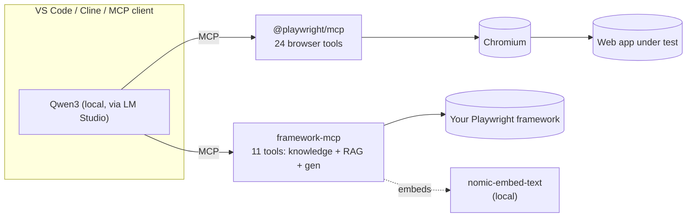

# PlayWright-RAG-CustomMCP

Turn your Playwright test framework into something an LLM can **understand, explain, search, and extend** — running **fully locally** (no cloud, no API keys) via [LM Studio](https://lmstudio.ai), usable from VS Code / Cline / any MCP client.

It combines two things:

- a **Custom MCP server** that gives the model deep, structured knowledge of *your* framework, and
- a **local RAG** layer so anyone can ask questions about the framework in plain English.

Browser automation is provided by the official **[`@playwright/mcp`](https://github.com/microsoft/playwright-mcp)**, so you also get exact Playwright-MCP capabilities alongside the custom layer.

---

## What you get

### 🧠 The Custom MCP — *your framework's brain*

Out of the box, an LLM knows *generic* Playwright. It does **not** know your page objects, your fixtures, or your team's conventions — so it writes throwaway `page.click(...)` scripts. The custom MCP fixes that. It lets the model:

- **Understand the framework** — list every Page Object and its methods, see existing tests, read any file, and get an auto-generated **architecture diagram**.
- **Write tests in *your* pattern** — because it knows your fixtures, page-object methods, tags, and data files, generated specs use `InventoryPage.addToCart()` + the `loggedIn` fixture + a proper `@tag`, **not** raw `page.*`.
- **Run tests** — execute a spec and report results, closing the author→verify loop.
- **Drive a real browser** — via the bundled official Playwright MCP (navigate, snapshot, click, type, hover, tabs, network, …).

**Who it helps:** a new joiner who needs to grok the framework fast; an engineer who wants a first-draft test that already follows house style; anyone documenting or reviewing the suite.

### 🔎 The RAG — *ask your framework anything*

Exact search (grep) only works if you know the keyword. RAG lets you ask in plain English and get the right place in the code — even when you don't know what it's called.

- **Natural-language questions** — *"where do we handle locked-out logins?"*, *"how is the cart badge counted?"* → returns the most relevant code/doc chunks with `file:line` and a similarity score.
- **Grounded answers** — the model reasons over *your real source*, not guesses, so explanations and generated tests stay accurate.
- **100% local & private** — chunks are embedded with a local model (`nomic-embed-text` via LM Studio); nothing leaves your machine.

**Who it helps:** anyone onboarding to an unfamiliar framework, or hunting for "where does X happen" without spelunking the repo.

> **Exact + semantic, together:** `search_code`/`list_page_objects` for precise symbol lookups, `semantic_search` for fuzzy intent. The model picks the right one per question.

---

## Architecture



---

## Tools

### `framework-mcp` (this repo, 11 tools)

| Tool | What it does |
|------|--------------|
| `list_page_objects` | Page Object classes + public methods + locators (`ts-morph`) |
| `list_tests` | Spec files, titles, `@tags` |
| `get_test_conventions` | **Pattern engine** — import header, fixtures, method catalog, tags, rules, template |
| `search_code` / `read_file` | Exact grep + read (path-guarded) |
| `semantic_search` | **RAG** — natural-language search via local embeddings |
| `build_rag_index` | (Re)build the local embedding index |
| `get_architecture` | Mermaid diagram (`overview` / `pages`) |
| `write_architecture_doc` | Generate + write a complete `ARCHITECTURE.md` |
| `create_test_file` | Write a new `*.spec.ts` into `tests/` |
| `run_test` | Run Playwright and return results |

Env config: `FRAMEWORK_ROOT` (project to analyse), `FRAMEWORK_ONLY=1` (drop built-in browser tools when composed with Playwright MCP), `MCP_HEADLESS=1`, `EMBED_MODEL` / `LMSTUDIO_EMBED_URL` (RAG endpoint; defaults to `text-embedding-nomic-embed-text-v1.5` on `http://localhost:1234/v1/embeddings`).

### `@playwright/mcp` (official, 24 tools)

`browser_navigate`, `browser_snapshot`, `browser_click`, `browser_type`, `browser_hover`, `browser_drag`, `browser_select_option`, `browser_tabs`, `browser_handle_dialog`, `browser_file_upload`, `browser_network_requests`, `browser_evaluate`, `browser_wait_for`, … — exact, Microsoft-maintained.

---

## Prerequisites

- **Node.js 18+** and **npm**
- **[LM Studio](https://lmstudio.ai)** with:
  - a **tool-calling chat model** — **Qwen3** recommended (`qwen/qwen3-8b` or `qwen/qwen3-14b`). *The model must emit structured tool calls; some coder models emit them as plain text the client can't run.*
  - an **embedding model** — `text-embedding-nomic-embed-text-v1.5` (for RAG)
- macOS / Linux / Windows

---

## Setup

### 1. Build

```bash
cd framework-mcp && npm install && npm run build
cd ../playwright-pom-framework && npm install && npx playwright install chromium
npm install -D @playwright/mcp            # official Playwright MCP
```

### 2. Start the local models (LM Studio)

```bash
lms server start
lms load qwen/qwen3-14b -c 40960 --gpu max            # chat model, big context for the ~35-tool prompt
lms load text-embedding-nomic-embed-text-v1.5 -y      # embedding model for RAG
```

### 3. Register both MCP servers

**VS Code** — `.vscode/mcp.json` in your framework project:

```json
{
  "servers": {
    "playwright": {
      "type": "stdio",
      "command": "/usr/local/bin/node",
      "args": ["<ABS_PATH>/playwright-pom-framework/node_modules/@playwright/mcp/cli.js"]
    },
    "framework": {
      "type": "stdio",
      "command": "/usr/local/bin/node",
      "args": ["<ABS_PATH>/framework-mcp/dist/index.js"],
      "env": { "FRAMEWORK_ROOT": "${workspaceFolder}", "FRAMEWORK_ONLY": "1" }
    }
  }
}
```

**LM Studio** — `~/.lmstudio/mcp.json` uses the same block under key `mcpServers`. **Cline** — same block in its MCP config.

> Use the **absolute** `node` path (`which node`) — GUI apps launch MCP servers with a minimal `PATH` that often omits `/usr/local/bin`.

### 4. Point your chat client at the local model

- **Cline / Continue** (easiest) → provider **LM Studio** (no API key), pick `qwen/qwen3-14b`. Keep the **standard** system prompt (Cline's compact prompt disables MCP).
- **VS Code Copilot Chat** → *Manage Models* → custom/OpenAI-compatible endpoint: model **url** `http://localhost:1234/v1/chat/completions` (must be absolute), id `qwen/qwen3-14b`, `toolCalling: true`, `vision: false`, API key = any placeholder.

---

## How to use

With a model loaded and both servers running, open your client's **agent mode** and just ask. The model calls the tools for you.

**Understand the framework**
> "Explain this framework and show its architecture diagram."
> "What page objects and methods are available?"
> "Generate the architecture doc." → writes `ARCHITECTURE.md`

**Ask questions (RAG)**
> "Where do we handle locked-out or invalid logins?"
> "How is the shopping-cart badge counted?"

**Author a test in your pattern**
> "Open saucedemo, log in as standard_user, add a backpack to the cart, then write a test for it in this framework's Page Object style and run it."

That last one runs the full pipeline: **Playwright MCP** drives the browser → **framework-mcp** reads conventions + page objects → writes a POM-style spec → `run_test` executes it.

> First `semantic_search` builds the index automatically. After big code changes, ask it to **"rebuild the RAG index."**

---

## Adapt it to *your* framework

This is designed to drop onto any Playwright POM project. Two levels:

### Level 1 — just point it (works if you follow common POM conventions)
Set `FRAMEWORK_ROOT` to your repo (the `env` in the MCP config). No code changes needed if your repo has:
- page objects in files under a `pages/` directory,
- a fixtures file whose name contains "fixture",
- specs in `tests/**/*.spec.ts` with `@word` tags in titles,
- shared data in `src/data`.

Then rebuild the index once (call `build_rag_index` / `semantic_search`).

### Level 2 — adjust the assumptions (if your layout differs)
Everything lives in **`framework-mcp/src/analysis.ts`** — edit these spots, then `npm run build`:

| If your… | Edit |
|---|---|
| Page objects aren't under `/pages/` | the `.includes("/pages/")` filter in `listPageObjects` and the diagram functions |
| Fixtures file / import path differ | the glob in `extractFixtureNames` and the `importHeader` string in `getTestConventions` |
| Conventions differ (imports, fixtures, tagging) | the `rules` and `template` in `getTestConventions` — write them in your team's words |
| Specs live elsewhere / different suffix | `listTests` (`tests/` + `.spec.ts`) and the target dir in `createTestFile` |
| You want RAG over more file types | the `/\.(ts|md)$/` filter in **`framework-mcp/src/rag.ts`** |

Because the model reads `get_test_conventions` before generating, **the single highest-leverage edit is the `rules`/`template`** — describe your house style there and generated tests follow it.

---

## Sample framework

A realistic Playwright + TypeScript POM against [SauceDemo](https://www.saucedemo.com), used as the system-under-test and RAG corpus.

| Test type | File | Tag |
|-----------|------|-----|
| Smoke / positive auth | `tests/auth/login.spec.ts` | `@smoke` |
| Data-driven negative | `tests/auth/login.spec.ts` | `@negative` |
| Functional / state | `tests/inventory/inventory.spec.ts` | `@functional` |
| End-to-end journey | `tests/e2e/checkout.spec.ts` | `@e2e` |

```bash
cd playwright-pom-framework
npm test            # all tests headless
npm run report      # open the HTML report
```

---

## Troubleshooting

| Symptom | Fix |
|---|---|
| MCP server "command not found" | Use the absolute `node` path in the config (GUI PATH is minimal). |
| `exceeds the available context size` | Reload the chat model with a larger `-c` (e.g. `-c 40960`) — the tool schemas + agent prompt are large. |
| Model prints the tool call as text instead of running it | Use a model with **structured** tool calling (Qwen3); update the client / LM Studio. |
| `Failed to parse URL … /v1/chat/completions` (VS Code) | Set the model **url** to the full absolute endpoint. |
| Cline says MCP unsupported | You're on the compact prompt — switch to the standard prompt. |
| `Embeddings request failed` | Load the embedding model in LM Studio and ensure the server is running. |
| Slow responses | Disable Qwen3 "thinking" for agent use; use the 14B with full GPU offload. |

---

## Roadmap

- **Hybrid ranking** — blend exact (grep/AST) and semantic (RAG) results into one ranked answer.
- **Step → POM generator** — auto-map recorded browser steps to page-object calls as a first-draft spec.
- **Multi-framework** — one server instance serving several repos.

---

## Author

**Gembali Bhargav** — [@pruthive580](https://github.com/pruthive580)

## License

MIT © Gembali Bhargav
