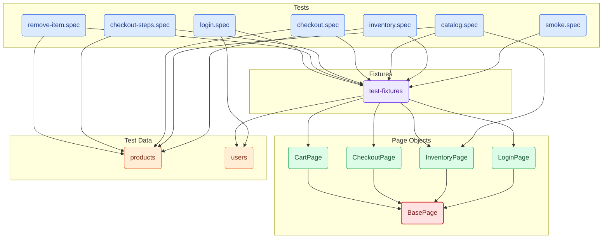
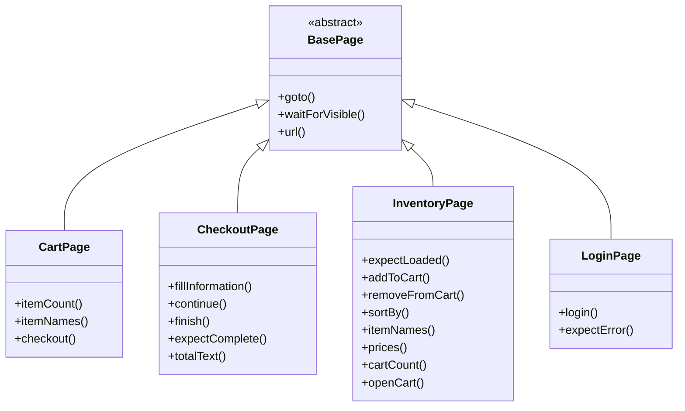

# playwright-pom-framework — Architecture

_Generated by **framework-mcp** from static analysis (ts-morph). Regenerate any time with the `write_architecture_doc` tool._

## Dependency overview

## Page Object Model

## Page objects & methods

| Class | Extends | Public methods |
|---|---|---|
| `BasePage` _(abstract)_ | — | `goto()`, `waitForVisible(locator)`, `url()` |
| `CartPage` | `BasePage` | `itemCount()`, `itemNames()`, `checkout()` |
| `CheckoutPage` | `BasePage` | `fillInformation(firstName, lastName, postalCode)`, `continue()`, `finish()`, `expectComplete()`, `totalText()` |
| `InventoryPage` | `BasePage` | `expectLoaded()`, `addToCart(name)`, `removeFromCart(name)`, `sortBy(option)`, `itemNames()`, `prices()`, `cartCount()`, `openCart()` |
| `LoginPage` | `BasePage` | `login(username, password)`, `expectError(message)` |

## Tests

| Tag | Count |
|---|---|
| @e2e | 2 |
| @functional | 8 |
| @negative | 1 |
| @smoke | 2 |
